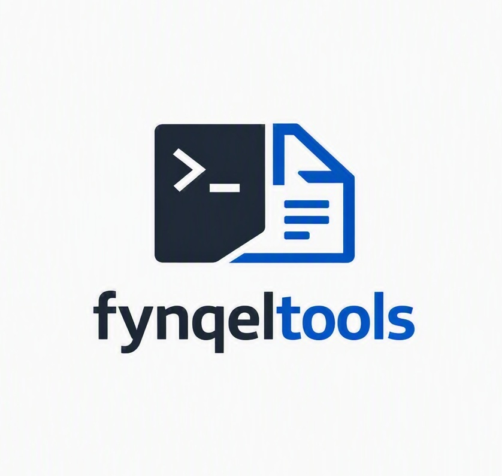

  

<h1 align="center">fynqeltools</h1>

  <strong>👨‍💻 fynqeltools is a simple and lightweight tool for managing files in the terminal.</strong>

  With "fynqel", you can save your files, view saved files, search for a specific file, delete files, and export them back to another path.

 

## ◉ Features

◉ Save files inside "fynqeltools"  
◉ View saved files  
◉ Search for files  
◉ Delete a specific file or all files  
◉ Export a file to another path  
◉ Show copy progress  
◉ Check available storage before copying  

 

## ◉ Usage

To save a file:

    fynqel /path/to/file

To view saved files:

    fynqel list

To search for a file:

    fynqel search filename

To delete a file:

    fynqel delete filename

To delete all files:

    fynqel delete all

To export a file to another path:

    fynqel file filename

 

## ◉ Commands

| Command | Description |
|---------|-------------|
| `fynqel [path]` | Copy a file to fynqeltools |
| `fynqel list` | List saved files |
| `fynqel search [name]` | Search for a file |
| `fynqel delete all` | Delete all files |
| `fynqel delete [name]` | Delete a specific file |
| `fynqel file [name]` | Export a file to another path |

 

😅 The project is simple and easy to use.

 

## ◉ License

This project is licensed under the Apache License 2.0.  
Copyright 2026 CodeTansarian  

You can use it, modify it, and build on it.
